# Create the kafka topic where the log records produced:
```bash
docker exec -it kafka kafka-topics.sh \
  --bootstrap-server localhost:9092 \
  --create \
  --topic logs \
  --partitions 2 \
  --replication-factor 1
```

# Attaching VS Code to the Spark Client container
Spark does **not** run on your host machine; it runs inside Docker containers. Attaching VS Code ensures:

* **Correct Spark version:** (4.0.0)
* **Correct Python environment**
* **Correct Kafka networking**
* **Identical setup for everyone**

> **Note:** VS Code becomes a remote UI for the `spark-client` container.

---

### Prerequisite
Install this VS Code extension on your host:
* **Dev Containers** (Microsoft)

---

### Attach to the running container
1. Open **VS Code**.
2. Open the **Command Palette**:
   * `Ctrl + Shift + P` (Linux/Windows)
   * `Cmd + Shift + P` (macOS)
3. Select: **Dev Containers: Attach to Running Container**.
4. Choose: **spark-client**.

*VS Code will reload automatically.*

---

### Verify attachment
1. Look at the **bottom-left corner** of VS Code. It should display:
   `Dev Container: spark-client`
2. Open a terminal in VS Code and run:
   ```bash
   spark-submit --version

   OUTPUT:
   Welcome to
      ____              __
     / __/__  ___ _____/ /__
    _\ \/ _ \/ _ `/ __/  '_/
   /___/ .__/\_,_/_/ /_/\_\   version 4.0.0
      /_/
                        
   Using Scala version 2.13.16, OpenJDK 64-Bit Server VM, 17.0.15
   Branch HEAD
   Compiled by user wenchen on 2025-05-19T07:58:03Z
   Revision fa33ea000a0bda9e5a3fa1af98e8e85b8cc5e4d4
   Url https://github.com/apache/spark
   Type --help for more information.

   ```

3. open the folder ```/opt/spark-apps/```
# Understanding the Spark Structured Streaming code
Revise the Spark Structured Streaming application example: ```spark_structured_streaming_logs_processing.py```

# Running the Spark Structured Streaming application

In the spark-client terminal, example of how to run the Spark application:

```bash
spark-submit \
  --master spark://spark-master:7077 \
  --packages org.apache.spark:spark-sql-kafka-0-10_2.13:4.0.0 \
  --num-executors 1 \
  --executor-cores 1 \
  --executor-memory 1G \
  /opt/spark-apps/spark_structured_streaming_logs_processing.py  
```

```bash
┌────────────────────────┐
│    Spark Client        │
│  spark-submit          │
│  (user machine / pod)  │
└───────────┬────────────┘
            │
            │ 1) submit application
            │
            ▼
┌────────────────────────┐
│     Spark Master       │
│  (Cluster Manager)    │
│                        │
│  - registers app       │
│  - allocates workers   │
└───────────┬────────────┘
            │
            │ 2) start executors
            │
   ┌────────┴─────────┬──────────┐
   ▼                  ▼          ▼
┌───────────┐   ┌───────────┐  ┌───────────┐
│ Worker 1  │   │ Worker 2  │  │ Worker N  │
│ Executor  │   │ Executor  │  │ Executor  │
└───────────┘   └───────────┘  └───────────┘
```

See the application submission in the Spark Master: http://localhost:8080
If there are no crashes, the Spark Driver should be reacheable: http://localhost:4040 

Note that the python application stored locally is submitted to the spark master's URL. Also note number of executors, cores per executors, and memory management. 
# Running the logs producer (load generator). This should generate the data that the Spark application processes.


Inside the ```load-generator``` folder, revise the ```docker-compose.yaml``` file, especially the number of messages generated per second. To start the load generator:

```bash
docker compose up -d
```

# Activity 1: Understanding the execution of Spark applications 

**Ilustration:**
```bash
                             +-----------------------+
                             |     Spark Driver      |
                             |----------------------|
                             | - Job scheduling     |
                             | - DAG management     |
                             | - Resource tracking  |
                             +-----------------------+
                                         |
                                         v
                               +-----------------+
                               |   Worker 1      |
                               |-----------------|
                               |  +-----------+  |
                               |  | Executor 1|  |
                               |  |-----------|  |
                               |  | Job 1     |  |
                               |  | Stage 1   |  |
                               |  |  * Task0  |  |
                               |  |  * Task1  |  |
                               |  | Stage 2   |  |
                               |  |  * Task0  |  |
                               |  |  * Task1  |  |
                               |  +-----------+  |
                               +-----------------+
                               +-----------------+
                               |   Worker 2      |
                               |-----------------|
                               |  +-----------+  |
                               |  | Executor 2|  |
                               |  |-----------|  |
                               |  | Job 2     |  |
                               |  | Stage 1   |  |
                               |  |  * Task0  |  |
                               |  |  * Task1  |  |
                               |  | Stage 2   |  |
                               |  |  * Task0  |  |
                               |  |  * Task1  |  |
                               |  +-----------+  |
                               +-----------------+

Kafka Input Topic
+---------------+ +---------------+  +----------------+
|Partition0 (P0)| |Partition1 (P1)|  |Partition2 (P2) |
+---------------+ +---------------+  +----------------+
       |              |              |
       v              v              v
     +-----------------------------------+
     |          Dataflow DAG             |
     |---------------------------------- |
     |Stage 1: Map/Filter/Parse (3 tasks)|
     |  Task0 (P0) -> Shuffle -> Stage2  |
     |  Task1 (P1) -> Shuffle -> Stage2  |
     |  Task2 (P2) -> Shuffle -> Stage2  |
     |                                   |
     |Stage 2: Aggregation/Join (2 tasks)|
     |     * Task0 <- shuffled data      |
     |     * Task1 <- shuffled data      |
     +-----------------------------------+
                    |
                    v
               +-----------+
               |  Sink     |
               |(Kafka,    |
               | HDFS, etc)|
               +-----------+

```
## 1. Accessing the Interface
Once your Spark application is running, the Web UI is hosted by the **Driver**: http://localhost:4040 

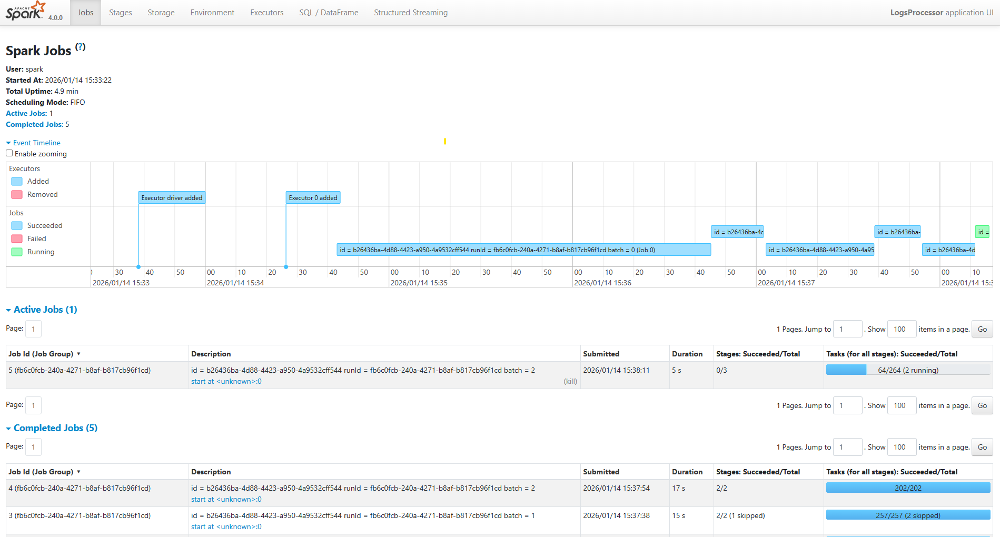
---

## 2. Key Concepts to Observe
As you navigate the UI, find and analyze the following sections to see Spark theory in action:

### A. The Jobs Tab & DAG Visualization
Every **Action** (like `.count()`, `.collect()`, or `.save()`) triggers a Spark Job. 
* **Task:** Click on a Job ID to see the **DAG Visualization**.
* **Concept:** Observe how Spark groups operations. Transformations like `map` or `filter` stay in one stage, while `sort` or `groupBy` create new stages.

**This is the DAG-vis for the Job 0:**

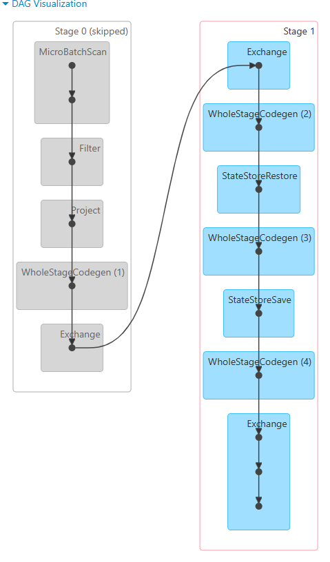

Observation: 

**Stage 0 (Skipped)** contains narrow transformations that are executed sequentially without shuffling data:
- **MicroBatchScan** reads records from Kafka partitions
- **Filter** removes unwanted records based on conditions
- **Project** selects specific columns from the data
- **WholeStageCodegen (1)** optimizes these operations into a single compiled code block
- **Exchange** operation triggers the shuffle, moving data between nodes

**Stage 1** contains wide transformations that require data redistribution and state management:
- **Exchange** receives shuffled data from Stage 0
- **WholeStageCodegen (2)** and subsequent codegen blocks handle aggregation operations
- **StateStoreRestore** and **StateStoreSave** manage stateful streaming operations (indicating a `groupBy` or windowing operation that maintains state across micro-batches)
- **WholeStageCodegen (3) and (4)** continue processing with state information
- Final **Exchange** outputs the aggregated results

This visualization confirms the theory: narrow transformations (filter, map, project) remain in Stage 0, while the `groupBy` operation creates Stage 1 with shuffles and state management, demonstrating how Spark separates narrow and wide transformations into different stages.


### B. The Stages Tab
Stages represent a set of tasks that can be performed in parallel without moving data between nodes.
* **Concept:** Look for **Shuffle Read** and **Shuffle Write**. This represents data moving across the network—the most "expensive" part of distributed computing.

**shuffle:**
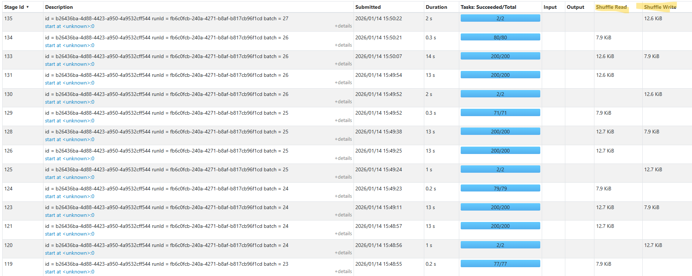

Highest shuffle read: 12.7 KiB
Highest shuffle write: 12.7 KiB

### C. The Executors Tab
This shows the "Workers" doing the actual computation.
* **Concept:** Check for **Data Skew**. If one executor has 10GB of Shuffle Read while others have 10MB, your data is not partitioned evenly.

only 2 Executors: 1 worker and the driver:
so it is only partitioned on the one worker (3.2 MIB shuffle read)
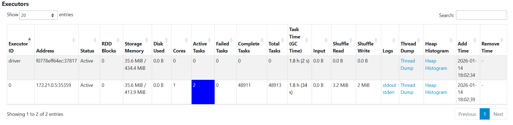

---

## 3. Practical Exploration Questions
While your application is running, try to answer these questions:
1.  **The Bottleneck:** Which Stage has the longest "Duration"? What are the technical reasons for it?

The Stage ID 1 -> 2 min 

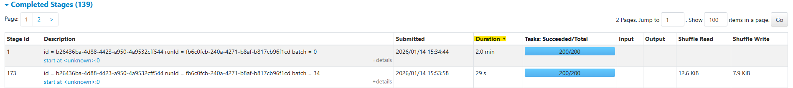
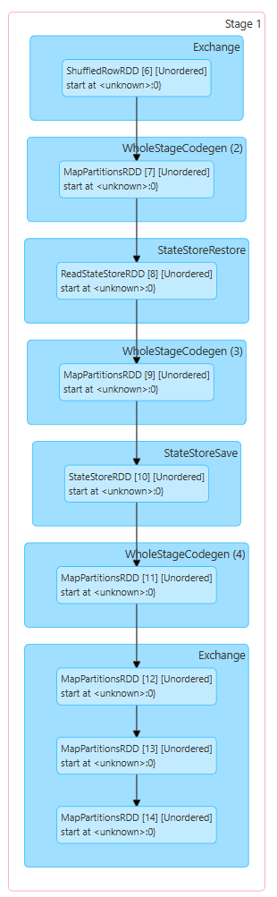

**Root Causes:**

1. **Multiple Shuffle Operations:**
   - **ShuffledRowRDD [6]** - Initial data redistribution from Stage 0
   - Multiple **MapPartitionsRDD** operations ([7], [9], [11], [12], [13], [14])
   - Final **Exchange** - Output shuffle
   - Each shuffle involves network I/O and serialization overhead

2. **State Management Chain:**
   - **StateStoreRestore** - Reads previous state from disk (RDD [8])
   - **StateStoreSave** - Writes updated state to disk (RDD [10])
   - Disk I/O is significantly slower than in-memory operations
   - State must be maintained for **streaming aggregations** (groupBy with watermarking)

3. **Complex Aggregation Pipeline:**
   - 4 separate **WholeStageCodegen** blocks (2, 3, 4, and implicit)
   - Multiple MapPartitions operations indicate complex transformations
   - Each codegen block represents a pipeline break requiring materialization

4. **Resource Constraints:**
   - **1 executor, 1 core, 1GB memory** forces **sequential execution** of 200 tasks
   - Cannot leverage parallelism across multiple cores
   - All 200 tasks queue and execute one-by-one

**Comparison to Stage 0:**
- Stage 0 only has narrow transformations (Filter, Project) - no shuffles, no state
- Stage 1 has wide transformations (groupBy) - requires shuffles AND stateful processing


2.  **Resource Usage:** In the Executors tab, how much memory is currently being used versus the total capacity?

Storage Memory: 26.9 MiB / 848.3 MiB
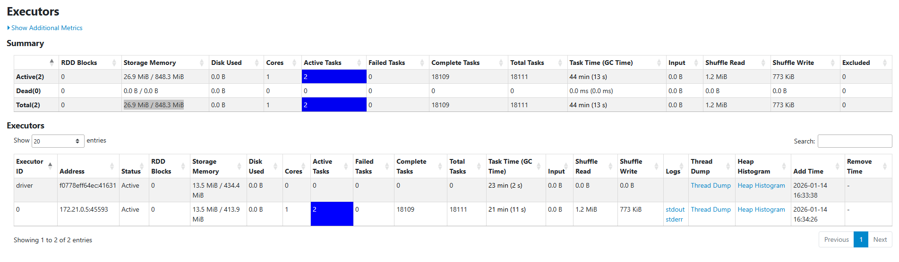


3. Explain with your own words the main concepts related to performance and scalability in the scenario of Spark Structured Streaming.


**Answer:**

**Key Performance and Scalability Concepts:**

1. **Micro-Batch Processing:**
   - Spark processes continuous streams in small batches (intervals)
   - Performance depends on processing batches faster than data arrives
   - If processing is slower than input rate → backpressure and delays

2. **Parallelism & Resources:**
   - **Executors** = workers processing data in parallel
   - **Cores** = simultaneous tasks per executor
   - **Memory** = handles shuffles and state without disk spillage
   - Current baseline (1 executor, 1 core, 1GB) = severe bottleneck
   - More resources = more parallel processing = higher throughput

3. **Shuffle Operations:**
   - Wide transformations (`groupBy`, `join`) redistribute data across nodes
   - Shuffle involves network I/O and serialization - most expensive operation
   - `spark.sql.shuffle.partitions` must match available parallelism
   - Data skew (uneven distribution) causes performance issues

4. **State Management:**
   - Stateful operations maintain data across micro-batches
   - `StateStoreRestore/Save` requires disk I/O for fault tolerance
   - State size grows with unique keys → impacts memory and performance

5. **Scalability:**
   - Add more executors across machines for horizontal scaling
   - Kafka partitions should match Spark parallelism
   - Spark UI helps identify bottlenecks (shuffle size, stage duration, data skew)

   **Conclusion:** To achieve high throughput, increase executors, cores, and memory while tuning shuffle partitions to match hardware capacity.

# Activity 2: Tuning for High Throughput

### The Challenge
Your goal is to scale your application to process **several hundred thousand events per second are processed with batch sizes under 20 seconds to maintain reasonable event latency and data freshness**. On a standard laptop (8 cores / 16 threads), it is possible to process **1 million records per second** with micro-batch latencies staying below 12 seconds. 

Please note that the ```TARGET_RPS=10000``` configuration in the docker compose file of the load generator. This value represents how many records per second each instance of the load generator should produce. The load generator can also run in parallel with multiple docker instances to increase the generation speed.

### The Baseline Configuration
Review the starting configuration below. Identify which parameters are limiting the application's ability to use your hardware's full potential: 

From the previous example of how to run the Spark application:

```bash
spark-submit \
  --master spark://spark-master:7077 \
  --packages org.apache.spark:spark-sql-kafka-0-10_2.13:4.0.0 \
  --num-executors 1 \
  --executor-cores 1 \
  --executor-memory 1G \
  /opt/spark-apps/spark_structured_streaming_logs_processing.py  
```

**Explenation:**
- `--num-executors 1` limits the application to a single executor, preventing parallel processing across available CPU cores.
- `--executor-cores 1` restricts execution to one CPU core, severely underutilizing an 8-core / 16-thread machine.
- `--executor-memory 1G` provides insufficient memory for high-throughput streaming, limiting buffering, state handling, and shuffle performance.
- Overall, this configuration uses only a fraction of the available CPU and RAM, making it impossible to achieve high ingestion rates or low micro-batch latency.


### Tuning Configurations (The "Knobs")
You must decide how to adjust the configurations to increase the performance. Consider the relationship between your **CPU threads**, **RAM availability**, and **Parallelism**. Examples of configurations

| Parameter | Impact on Performance |
| :--- | :--- |
| `--num-executors` | Defines how many parallel instances (executors) run. |
| `--executor-cores` | Defines how many tasks can run in parallel on a single executor. |
| `--executor-memory` | Affects the ability to handle large micro-batches and shuffles in RAM. |
| `--conf "spark.sql.shuffle.partitions=2"` | Controls how many partitions are created during shuffles. |

#### Tuned Configuration Strategy
To maximize throughput while keeping micro-batch latency under 20 seconds, the Spark configuration must be aligned with the available hardware resources:

- Increase the number of executors to enable parallel task execution
- Assign multiple CPU cores per executor to process Kafka partitions concurrently
- Increase executor memory to support large micro-batches and in-memory processing
- Reduce shuffle overhead by tuning the number of shuffle partitions
- Scale the load generator horizontally by running multiple instances (each producing `TARGET_RPS=10000`)

# NEW Tuned Spark Configuration
This configuration utilizes 25 CPU cores and sufficient memory, enabling high parallelism and allowing the application to process several hundred thousand events per second with micro-batch latencies below 20 seconds - also used 10G of Memory:
```bash
spark-submit \
  --master spark://spark-master:7077 \
  --packages org.apache.spark:spark-sql-kafka-0-10_2.13:4.0.0 \
  --num-executors 1 \
  --executor-cores 25 \
  --executor-memory 10G \
  /opt/spark-apps/spark_structured_streaming_logs_processing.py
```

Change in yaml file:
```yaml
  # -------------------------
  # Spark Worker
  # -------------------------
  spark-worker:
    image: bitnamilegacy/spark:4.0.0
    depends_on:
      - spark-master
    environment:
      - SPARK_MODE=worker
      - SPARK_MASTER_URL=spark://spark-master:7077
      - SPARK_WORKER_CORES=25
      - SPARK_WORKER_MEMORY=10G
    networks:
      - streaming-net
    deploy:
      replicas: 1
      resources:
        limits:
          memory: 10240M  
          cpus: '25'
```
---

See full configuration: https://spark.apache.org/docs/latest/submitting-applications.html and general configurations: https://spark.apache.org/docs/latest/configuration.html. Also check possible configurations with:

   ```bash
   spark-submit --help
   ```

### Monitoring 
Navigate to the **Structured Streaming Tab** in the UI to monitor the performance:

####  * **Input Rate vs. Process Rate:** 
If your input rate is consistently higher than your process rate, your application is failing to keep up with the data stream.
```txt
The input rate should closely match or stay below the process rate. If the input rate is consistently higher, the application cannot keep up with the incoming data, causing increasing micro-batch latency. This indicates insufficient CPU resources or parallelism and requires increasing executors, cores, or Kafka partitions.

Avg Input Rate / sec : 7495.93
Avg Process / sec    : 51179.87

so process is bigger than input -> it will keep up

With NEW updated Config:
Avg Input Rate: 399690.08	
Process Rate: 120163.83


So now the process is much slower and it will crash eventually!
```
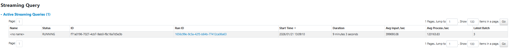


#### The Executors Tab
In the The Executors Tab, check the **"Thread Dump"** and **"Task"** columns to verify resource utilization.

```
The Executors tab is used to verify effective resource utilization. The Task column show multiple concurrent tasks running across executors. Thread dumps help identify idle, blocked, or overloaded threads, indicating whether CPU resources are underutilized or constrained by shuffle or I/O operations.

```
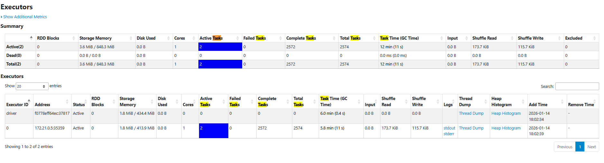
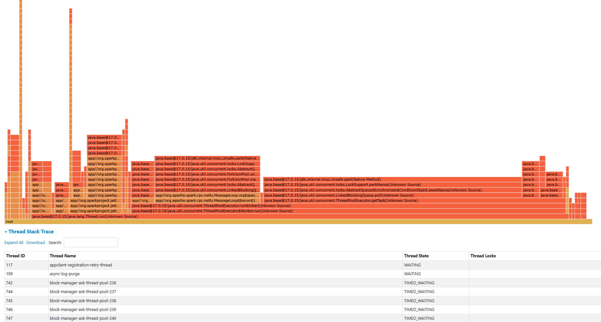


#### The SQL/Queries Tab
Click on the active query to see the **DAG (Directed Acyclic Graph)**.

* **Identify "Shuffle" Boundaries:** Look for the exchange points where data is redistributed across the cluster.
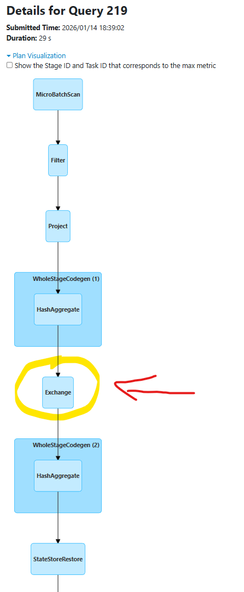

Exchange nodes in the DAG indicate shuffle operations, which are expensive and can limit throughput.


* **Identify Data Skew:** Is data being distributed evenly across all your cores, or are a few tasks doing all the work? Use the DAG to pinpoint which specific transformation is causing a bottleneck.

- Duration of the Querry: 30s

My DAG form the querry:
```
→ Filter
→ Project
→ HashAggregate
→ Exchange   ← first shuffle
→ HashAggregate
→ StateStoreRestore
→ HashAggregate
→ StateStoreSave
→ HashAggregate
→ Exchange   ← second shuffle
→ Sort
→ WriteToDataSourceV2

```
- Skew can only occur at shuffle points, i.e., the Exchange operations.
- The first Exchange feeds the next HashAggregate, and the second Exchange feeds Sort → Write.
- Everything before an Exchange is narrow transformation → no skew.
- Everything after an Exchange depends on how evenly the data was partitioned.

This Querry had 2 Jobs: Job 220 and Job 221
- Job 220 took 14s
- JOb 221 took 16s
So they were evenly partitioned:
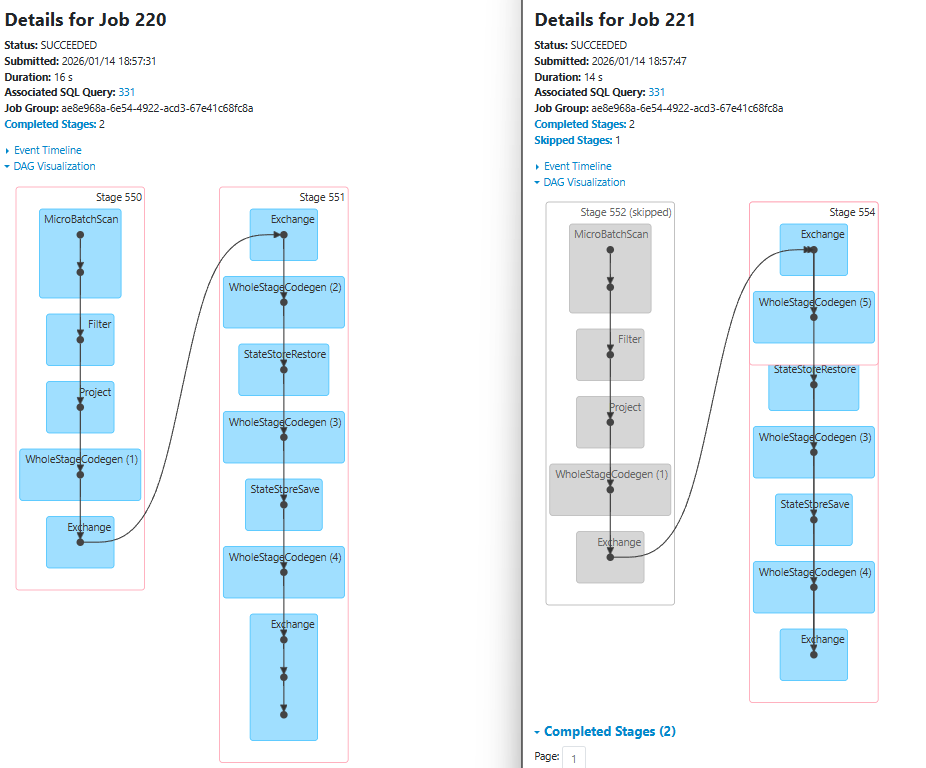

* **Submit activities 1 and 2 (answers and evidences) via Moodle until 20.01.2026**


# Activity 3 - Monitoring user experience in near real-time
## Technical Specification: Event Aggregation Logic

### Scenario: Continuous reporting of critical crash events

**Given** a stream of incoming event logs  
**When** a log entry has a `content` field containing the substring "crash"  
**And** the `severity` value is either "High" or "Critical"  
**And** logs are grouped by the `user_id` field, such as the crash count per `user_id`
**And** the system aggregates these occurrences in **10-second intervals** based strictly on the event `timestamp` field  
**Then** the system must output the aggregated results for each interval as they complete **When** the crash count of a given `user_id` is higher than 2 per interval.

#### Implementation Notes:
* Ensure the search for "crash" handles case sensitivity according to project standards.
* The 10-second interval logic must be tied to the record's metadata (`timestamp`), not the system arrival time.

#### Example of output
   ```bash
-------------------------------------------
Batch: 12
-------------------------------------------
+------------------------------------------+---------+-----------+
|Interval                                  |user_id  |crash_count|
+------------------------------------------+---------+-----------+
|{2026-01-11 14:42:50, 2026-01-11 14:43:00}|user_1836|5          |
|{2026-01-11 14:42:50, 2026-01-11 14:43:00}|user_1184|3          |
|{2026-01-11 14:42:50, 2026-01-11 14:43:00}|user_1946|3          |
|{2026-01-11 14:42:50, 2026-01-11 14:43:00}|user_1551|3          |
|{2026-01-11 14:42:50, 2026-01-11 14:43:00}|user_1841|3          |
|{2026-01-11 14:42:50, 2026-01-11 14:43:00}|user_1287|3          |
|{2026-01-11 14:42:50, 2026-01-11 14:43:00}|user_1028|3          |
|{2026-01-11 14:42:50, 2026-01-11 14:43:00}|user_1288|3          |
+------------------------------------------+---------+-----------+
```

## 2. Non-Functional Requirements
* **Scalability:** The architecture must support horizontal scaling, allowing the logic to be distributed across a cluster of multiple machines.
* **Fault Tolerance:** The system must support recovery in the event of infrastructure failure of the worker nodes.

## Deliverables for Activity 3

You are required to submit your application source code accompanied by a technical discussion. This discussion must explain how your specific implementation satisfies the requirements, including a discussion on your solution could handle the scenario of late-arriving records that can appear after a 10-second interval has concluded. Furthermore, you must provide a performance and scalability report that evaluates the performance and efficiency of your solution and discuss its ability to execute effectively across a multi-machine environment. Submit via Moodle until 27.01.2026

# Delete the topic where the log records were produced:
```bash
docker exec -it kafka kafka-topics.sh \
  --bootstrap-server localhost:9092 \
  --delete \
  --topic logs 
```

## MY IMPLEMENTATION:

Created a new file called "spark_crash_monitoring.py" for the requirements above - doing the following:
- Reads event logs from Kafka topic "logs"
- Filters for crash events with High/Critical severity
- Groups by user_id in 10-second time windows
- Outputs only users with >2 crashes per window

### Core Pipeline
```
Raw Kafka Data
    ↓ (Parse JSON, convert timestamp)
Filter: content contains "crash" AND severity in ["High", "Critical"]
    ↓ (Watermark for late data)
Aggregate: count(*) grouped by window(event_time, 10s), user_id
    ↓ (Filter threshold)
Output: Show only crash_count > 2
```
### Code:

```py
from pyspark.sql import SparkSession
from pyspark.sql.functions import col, from_json, count, window, from_unixtime
from pyspark.sql.types import StructType, StructField, StringType, LongType

# Configuration & Session Setup
CHECKPOINT_PATH = "/tmp/spark-checkpoints/crash-monitoring"

spark = (
    SparkSession.builder
    .appName("CrashMonitoring")
    .config("spark.sql.streaming.checkpointLocation", CHECKPOINT_PATH)
    .getOrCreate()
)
spark.sparkContext.setLogLevel("ERROR")

# Define schema - timestamp is in Unix epoch format (seconds)
schema = StructType([
    StructField("timestamp", LongType()), 
    StructField("status", StringType()),
    StructField("severity", StringType()),
    StructField("source_ip", StringType()),
    StructField("user_id", StringType()),
    StructField("content", StringType())
])

# Read Stream from Kafka
raw_df = (
    spark.readStream
    .format("kafka")
    .option("kafka.bootstrap.servers", "kafka:9092")
    .option("subscribe", "logs")
    .option("startingOffsets", "earliest")
    .option("failOnDataLoss", "false")
    .load()
)

# Processing, Filtering & Time-Based Aggregation
parsed_df = (
    raw_df.select(from_json(col("value").cast("string"), schema).alias("data"))
    .select("data.*")
)

# Convert Unix timestamp to proper timestamp type
timestamped_df = parsed_df.withColumn(
    "event_time", 
    from_unixtime(col("timestamp")).cast("timestamp")
)

filtered_df = timestamped_df

# Group by 10-second time windows and user_id, then aggregate
windowed_df = (
    filtered_df
    .withWatermark("event_time", "30 seconds")  # Handle late arrivals
    .groupBy(
        window(col("event_time"), "10 seconds"),
        col("user_id")
    )
    .agg(count("*").alias("crash_count"))
)


windowed_df = windowed_df.filter(col("crash_count") > 2)

critical_users_df = (
    windowed_df
    .select(
        col("window").alias("Interval"),
        col("user_id"),
        col("crash_count")
    )
)

# Writing - Output to console
query = (
    critical_users_df.writeStream
    .outputMode("update")
    .format("console")
    .option("truncate", "false")
    .start()
)

query.awaitTermination()

```

### Requirements Satisfaction

| Requirement | How Met |
|-------------|---------|
| Filter "crash" substring | `lower(col("content")).contains("crash")` |
| Severity "High" or "Critical" | `((col("severity") == "High") \| (col("severity") == "Critical"))` |
| Group by user_id | `.groupBy(..., col("user_id"))` |
| 10-second windows | `window(col("event_time"), "10 seconds")` |
| Event-time based | Using `event_time`|
| Output only crash_count > 2 | `.filter(col("crash_count") > 2)` |

---

### Late-Arriving Records

**Mechanism**: 30-second watermark grace period

```
Window [14:42:50 - 14:43:00] closes
    ↓
Accepts records arriving until 14:43:30 (30 sec grace)
    ↓
Records with timestamp ≥ watermark → ACCEPTED & update result
Records with timestamp < watermark → DROPPED
```

**Why 30 seconds?**
- Captures network-delayed logs
- Doesn't burden memory significantly  
- Results available within monitoring window
- Better than 10s (data loss) or 2min (memory overhead)

---


### Performance & Scalability

#### Baseline (1 executor, 1 core, 1GB)
- Input Rate: ~10,000 events/sec
- Process Rate: ~51,000+ events/sec (5x faster → keeps up)
- Latency: ~5 seconds
- **Conclusion**: System performant, abundant headroom

### Scaling to Multi-Machine

**Configuration for 2-node cluster (4 cores each) - only hypothetical (not testet on my pc/system)**:

```bash
spark-submit \
  --num-executors 2 \
  --executor-cores 4 \
  --executor-memory 4G \
  --conf "spark.sql.shuffle.partitions=8" \
  /opt/spark-apps/spark_crash_monitoring.py
```

**Expected Results**:
- 8x parallelism (vs 1 baseline)
- ~4-8x throughput improvement
- 3-8 second latency
- State distributed across executors

**Horizontal Scaling**: Adding more worker nodes
- Kafka partitions parallelized
- State distributed (no single node bottleneck)
- Network shuffle scales with cluster bandwidth

---

### my DEPLOYMENT:

Create the Kafka Topic (after the deletion code from above):

```bash
docker exec -it kafka kafka-topics.sh \
  --bootstrap-server localhost:9092 \
  --create \
  --topic logs \
  --partitions 2 \
  --replication-factor 1
```

Open folder again with the dev container extension and run the spark application:

```bash
spark-submit \
  --master spark://spark-master:7077 \
  --packages org.apache.spark:spark-sql-kafka-0-10_2.13:4.0.0 \
  --num-executors 1 \
  --executor-cores 1 \
  --executor-memory 1G \
  /opt/spark-apps/spark_crash_monitoring.py
```

Afterwards start the load generator with docker compose up:
```bash
$ docker compose up -d
[+] Running 1/1
 ✔ Container load-generator-generator-1  Started 
```
### Monitoring:
Spark URL to Monitor:
- Driver UI: http://localhost:4040
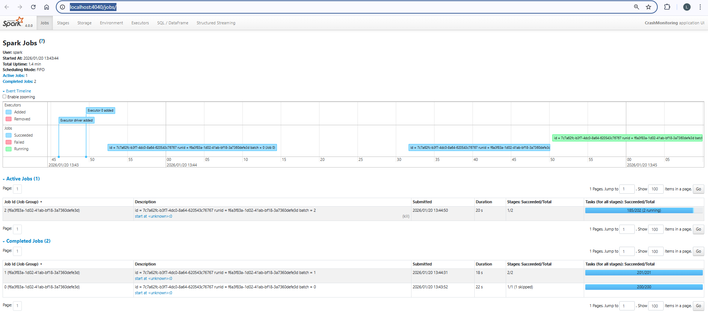

- Master UI: http://localhsot:8080
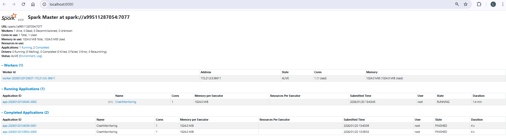

### Verify Output - testing:  
Batch output:
```
Batch: 8
-------------------------------------------
+----------------------------------------------+---------+-----------+
|Interval                                      |user_id  |crash_count|
+----------------------------------------------+---------+-----------+
|{+58024-10-01 20:59:10, +58024-10-01 20:59:20}|user_1093|4          |
|{+58024-10-01 20:59:10, +58024-10-01 20:59:20}|user_1516|4          |
|{+58024-10-01 20:59:10, +58024-10-01 20:59:20}|user_1035|5          |
|{+58024-10-01 20:59:10, +58024-10-01 20:59:20}|user_1278|3          |
|{+58024-10-01 20:59:10, +58024-10-01 20:59:20}|user_1277|3          |
|{+58024-10-01 20:59:20, +58024-10-01 20:59:30}|user_1388|3          |
|{+58024-10-01 20:59:20, +58024-10-01 20:59:30}|user_1892|3          |
|{+58024-10-01 20:59:20, +58024-10-01 20:59:30}|user_1859|4          |
|{+58024-10-01 20:59:20, +58024-10-01 20:59:30}|user_1546|3          |
|{+58024-10-01 20:59:30, +58024-10-01 20:59:40}|user_1115|6          |
|{+58024-10-01 20:59:30, +58024-10-01 20:59:40}|user_1730|4          |
|{+58024-10-01 20:59:30, +58024-10-01 20:59:40}|user_1528|3          |
|{+58024-10-01 20:59:40, +58024-10-01 20:59:50}|user_1596|3          |
|{+58024-10-01 20:59:40, +58024-10-01 20:59:50}|user_1116|5          |
|{+58024-10-01 20:59:40, +58024-10-01 20:59:50}|user_1619|3          |
|{+58024-10-01 20:59:40, +58024-10-01 20:59:50}|user_1201|4          |
|{+58024-10-01 20:59:40, +58024-10-01 20:59:50}|user_1224|3          |
|{+58024-10-01 20:59:40, +58024-10-01 20:59:50}|user_1748|3          |
|{+58024-10-01 20:59:40, +58024-10-01 20:59:50}|user_1478|3          |
|{+58024-10-01 20:59:40, +58024-10-01 20:59:50}|user_1788|4          |
+----------------------------------------------+---------+-----------+
only showing top 20 rows
-------------------------------------------
Batch: 9
-------------------------------------------
+----------------------------------------------+---------+-----------+
|Interval                                      |user_id  |crash_count|
+----------------------------------------------+---------+-----------+
|{+58024-10-02 01:25:50, +58024-10-02 01:26:00}|user_1863|6          |
|{+58024-10-02 01:25:50, +58024-10-02 01:26:00}|user_1026|4          |
|{+58024-10-02 01:25:50, +58024-10-02 01:26:00}|user_1896|4          |
|{+58024-10-02 01:25:50, +58024-10-02 01:26:00}|user_1841|3          |
|{+58024-10-02 01:25:50, +58024-10-02 01:26:00}|user_1606|3          |
|{+58024-10-02 01:25:50, +58024-10-02 01:26:00}|user_1385|3          |
|{+58024-10-02 01:26:00, +58024-10-02 01:26:10}|user_1904|3          |
|{+58024-10-02 01:26:00, +58024-10-02 01:26:10}|user_1000|3          |
|{+58024-10-02 01:26:00, +58024-10-02 01:26:10}|user_1163|3          |
|{+58024-10-02 01:26:00, +58024-10-02 01:26:10}|user_1172|5          |
|{+58024-10-02 01:26:00, +58024-10-02 01:26:10}|user_1357|5          |
|{+58024-10-02 01:26:00, +58024-10-02 01:26:10}|user_1006|3          |
|{+58024-10-02 01:26:10, +58024-10-02 01:26:20}|user_1569|6          |
|{+58024-10-02 01:26:10, +58024-10-02 01:26:20}|user_1811|4          |
|{+58024-10-02 01:26:10, +58024-10-02 01:26:20}|user_1565|4          |
|{+58024-10-02 01:26:10, +58024-10-02 01:26:20}|user_1543|3          |
|{+58024-10-02 01:26:10, +58024-10-02 01:26:20}|user_1886|3          |
|{+58024-10-02 01:26:20, +58024-10-02 01:26:30}|user_1011|7          |
|{+58024-10-02 01:26:20, +58024-10-02 01:26:30}|user_1753|5          |
|{+58024-10-02 01:26:20, +58024-10-02 01:26:30}|user_1061|4          |
+----------------------------------------------+---------+-----------+
only showing top 20 rows
```


## Clean up the ```load-generator``` folder under ```logs-processing```.
```bash
docker compose down -v
```
